<h1 align="center">Record: The Silver Cord</h1>

> Un sistema web enfocado en la catalogación y gestión de álbumes musicales. Desarrollado como proyecto académico para demostrar la implementación de operaciones CRUD, manejo de sesiones y conexión a bases de datos relacionales.

 

<h3 align="center">Características Principales:</h3> }

* **Autenticación Segura:** Sistema de registro e inicio de sesión con encriptación de contraseñas.
* **Gestión de Catálogo (CRUD):** Capacidad para registrar, visualizar, actualizar y eliminar álbumes.
* **Roles y Permisos:** Restricción de acceso a funciones avanzadas mediante la simulación de una suscripción premium ("The Silver Cord ++").
* **Búsqueda Dinámica:** Filtrado de registros en tablas en tiempo real utilizando JavaScript.
* **Interfaz de Usuario:** Diseño estético minimalista con menú lateral dinámico (Sidebar).

---

<h3 align="center">Stack Tecnológico:</h3>

| Área | Tecnologías |
| :--- | :--- |
| **Frontend** | HTML5, CSS, JavaScript |
| **Backend** | PHP |
| **Base de Datos** | MySQL |
| **Entorno Local** | XAMPP (Apache + MySQL) |

---

<h3 align="center">Instrucciones de Instalación (Entorno Local):</h3>

Para evaluar este proyecto en un entorno local, sigue estos pasos:

1. Clona este repositorio o descarga los archivos en el directorio raíz de tu servidor local (ej. `C:/xampp/htdocs/silverCord`).
2. Abre el panel de control de XAMPP e inicia los módulos de **Apache** y **MySQL**.
3. Dirígete a phpMyAdmin (`http://localhost/phpmyadmin/`).
4. Crea una nueva base de datos con el nombre **`silvercord`**.
5. Importa el archivo **`silvercord.sql`** (incluido en este repositorio) dentro de la base de datos recién creada para estructurar las tablas.
6. Abre tu navegador web y navega a `http://localhost/silverCord` (o la ruta correspondiente a tu carpeta) para visualizar el sistema.

---

<h3 align="center">Autor:</h3>

<strong>Leopoldo Javier Hermosillo Corrales</strong>

---

<h3 align="center">Capturas de Pantalla:</h3>

 

Pantalla Principal

 

  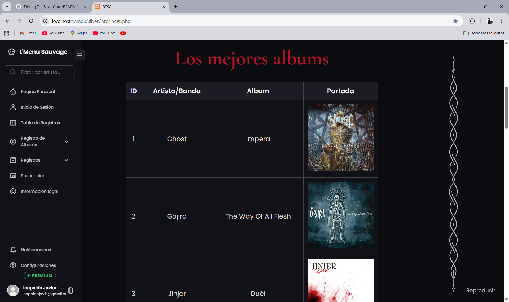

 

Filtrado de Albums

 

  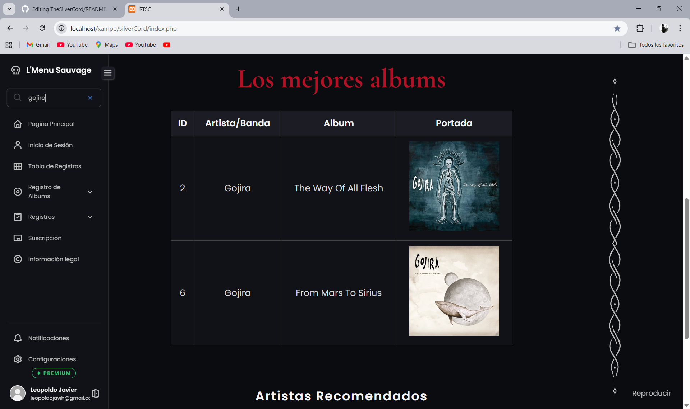

 

Inicio de Sesión

 

  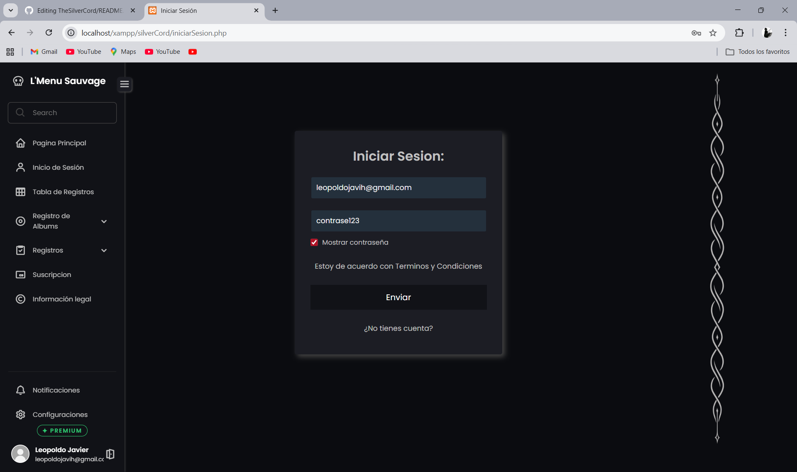

 

Tabla de Registros

 

  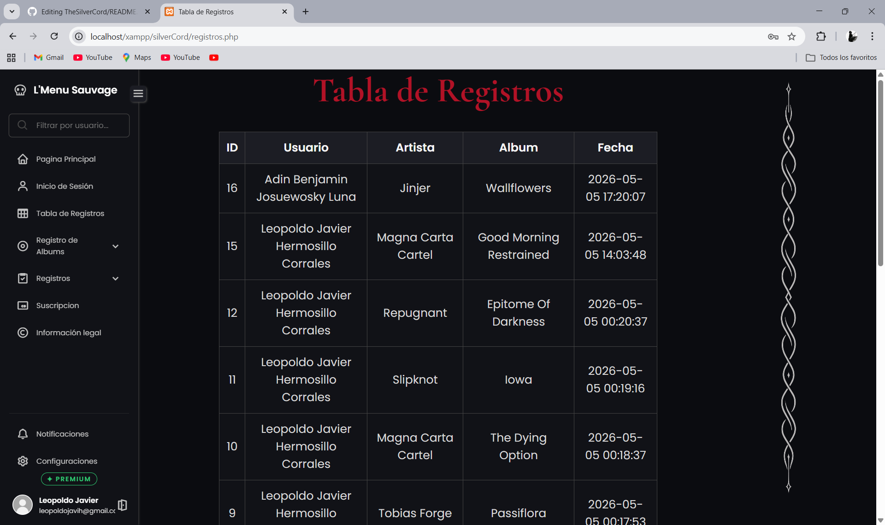

 

Filtrado de Registros

 

  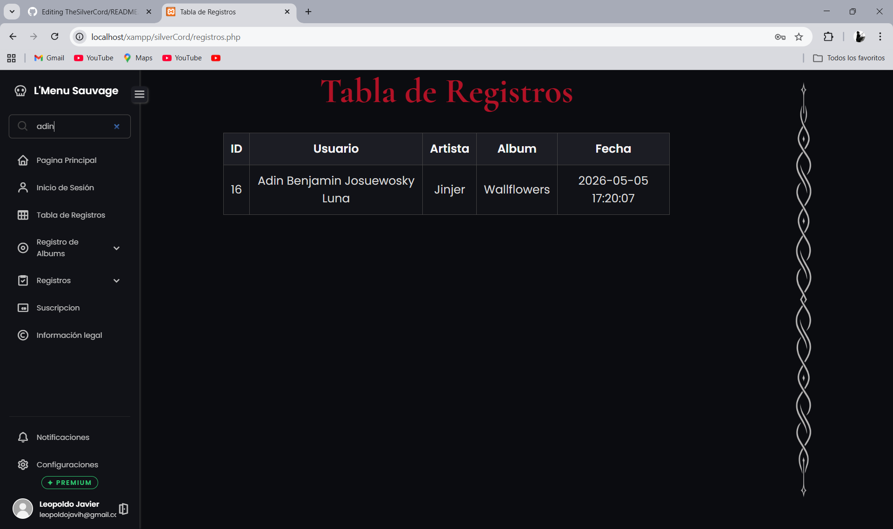

 

Registro de Albums

 

  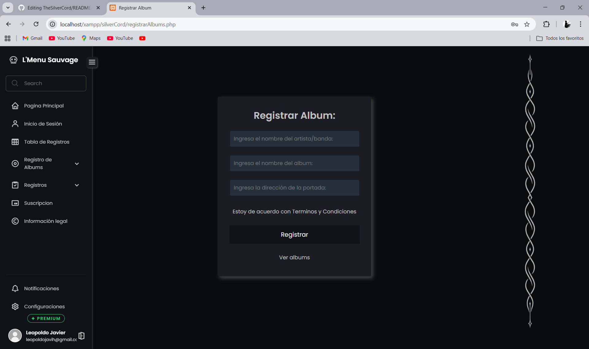

 

Actualizacion de Albums

 

  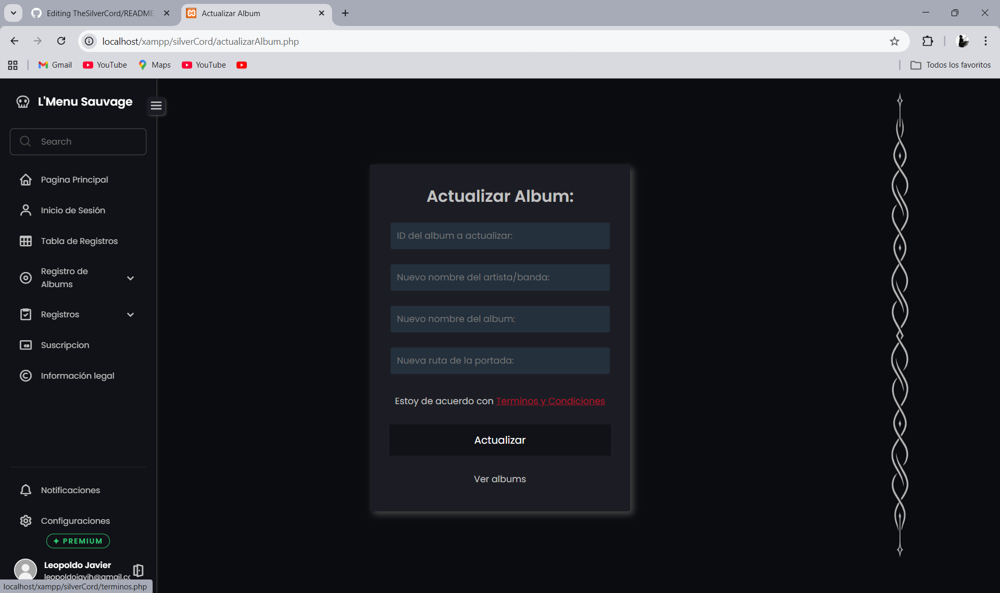

 

Borrado de Albums

 

  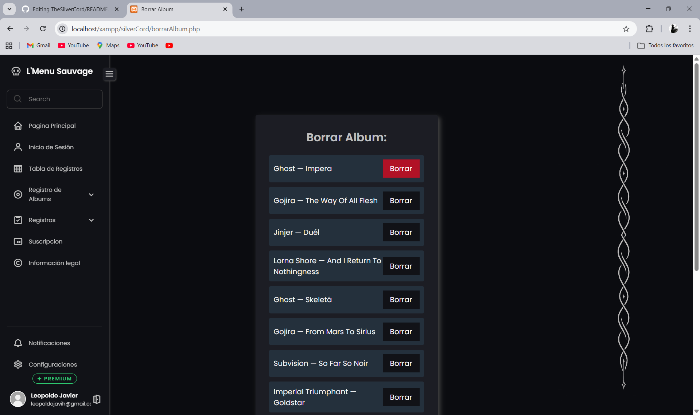

 

Registro de Cuentas

 

  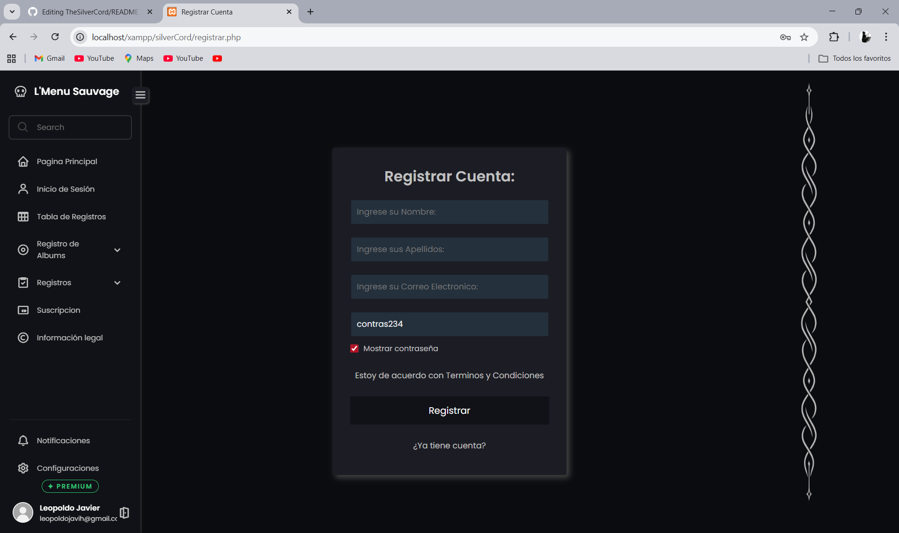

 

Actualización de Cuentas

 

  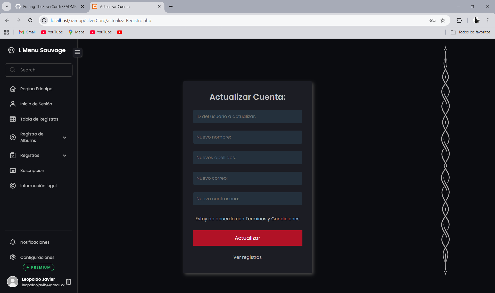

 

Borrado de Cuentas

 

  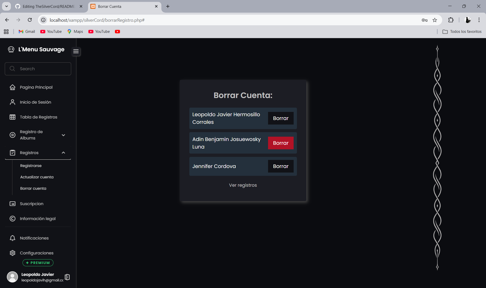

 

Registro de Tarjeta (Suscripción)

 

  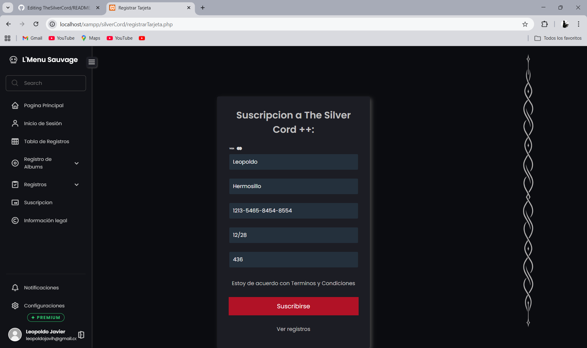

 

Información Legal

 

  

 

Restricción de Cuenta

 

  

 

Restricción de Plan

 

  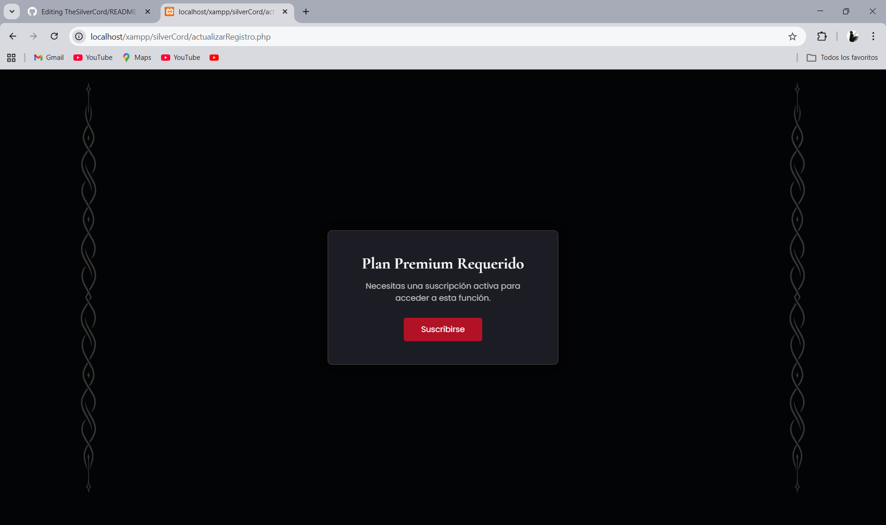

